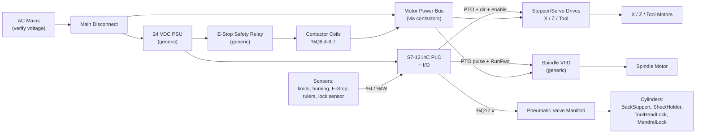
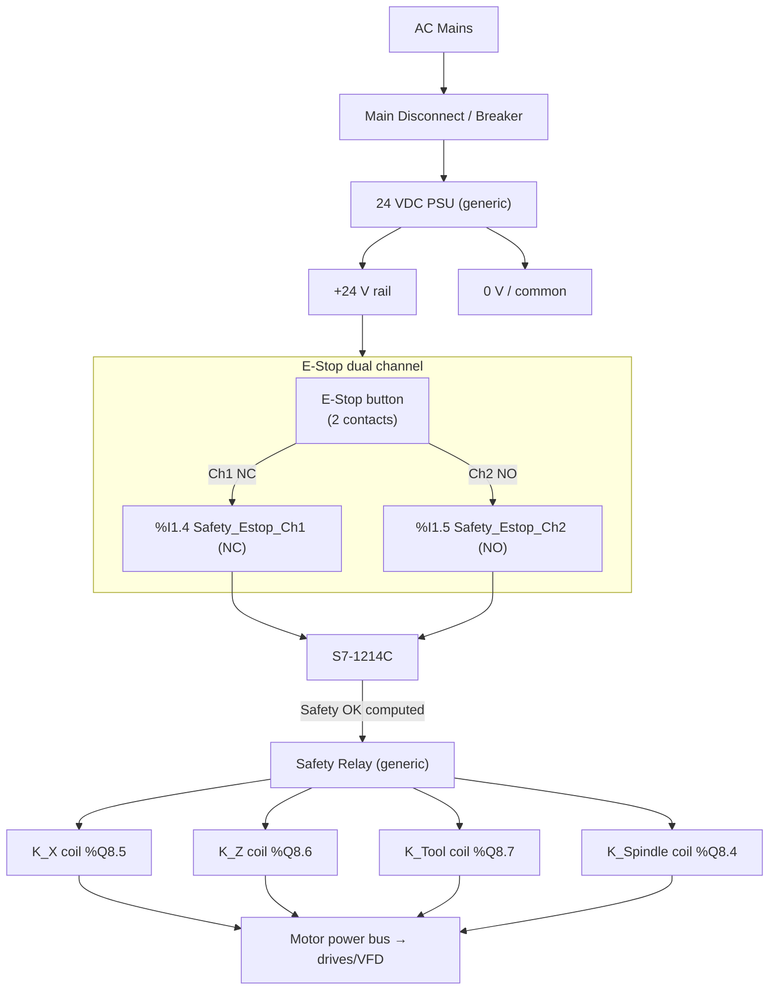
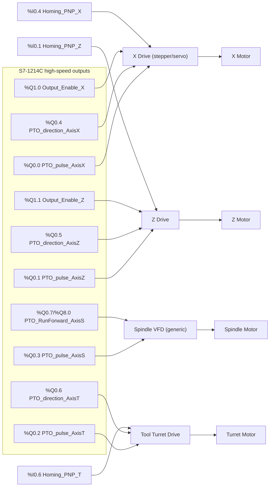
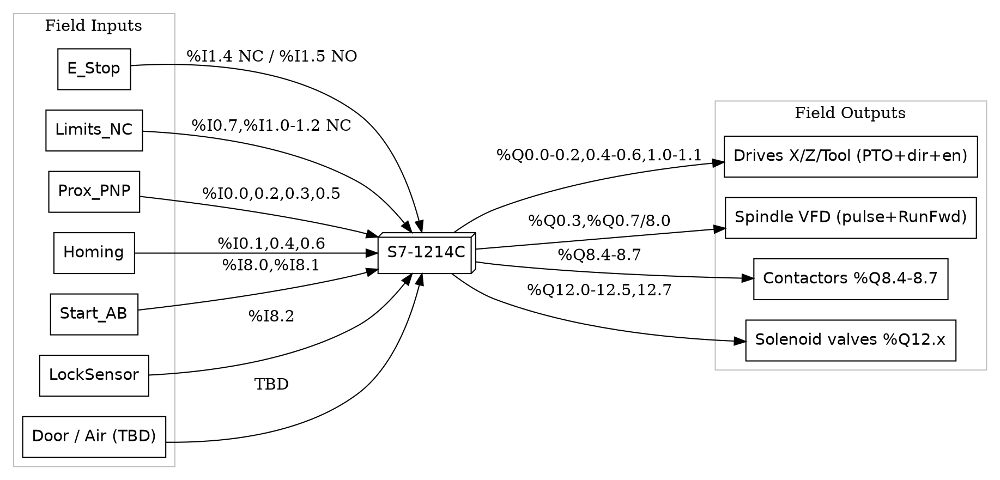
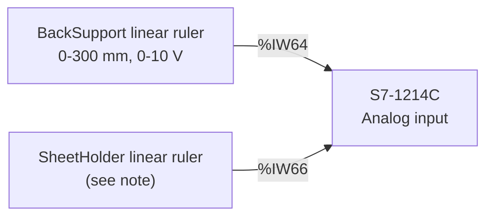
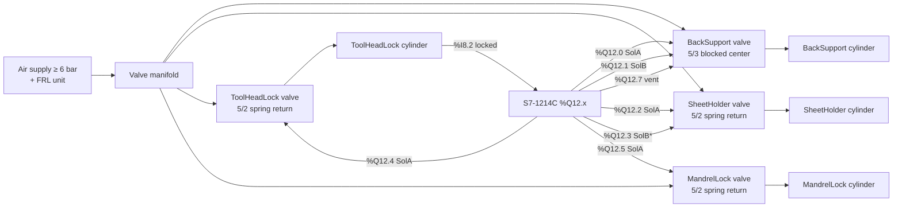

# Wiring Diagram — Metal Spinning Machine

**PLC:** Siemens S7-1214C (TIA Portal V17)
**Scope:** Full system — power distribution, safety circuit, motion drives/VFD, PLC digital/analog
I/O, pneumatic solenoid manifold.

This document is the field-wiring reference for the machine. Diagrams are written as **Mermaid**
(renders inline on GitHub and in VS Code with a Mermaid extension); Sheet 3 also includes a
**Graphviz DOT** block for users who prefer DOT.

---

## How to read this document

- **Address authority:** All PLC addresses come from the TIA Portal tag export
  `Program/docs/PLCTags.xlsx` and are cross-checked against the I/O references in
  `Program/08_Main_OB1.scl`. The SCL code uses symbolic tag names only — the addresses live in the
  PLC tag table.
- **Generic blocks:** Power-side hardware (24 V PSU, safety relay, VFD, stepper/servo drives, motors,
  contactors) is **not** defined in the PLC code. It is drawn as **generic blocks**. ⚠️ **Confirm every
  generic block against the actually installed panel hardware before wiring.**
- **Contact logic:** Pay attention to NC vs. NO/PNP logic and fail-safe states — see the Legend.

### ⚠️ Signals referenced in code but missing from the tag export (assign during commissioning)

These inputs are used in `08_Main_OB1.scl` but were **not present** in the `PLCTags.xlsx` export.
Assign real %I addresses during commissioning and update this document:

| Signal | Used in | Suggested type | Address |
|--------|---------|----------------|---------|
| `Panel_Stop` | OB1 fbProcess.Panel_Stop | DI (button / HMI) | **TBD** |
| `Panel_Pause` | OB1 fbProcess.Panel_Pause | DI (button / HMI) | **TBD** |
| `Panel_Reset` | OB1 fbProcess.Panel_Reset | DI (button / HMI) | **TBD** |
| `Safety_Door` | OB1 fbProcess.Door_Closed | DI (NC door switch) | **TBD** |
| `Safety_Air` | OB1 fbProcess.AirPressure_OK | DI (pressure switch) | **TBD** |

> Stop / Pause / Reset are operated from the HMI in the current build (see `HMI_Tag_Guide.md`,
> `DB_HMI.Btn_*`). If physical panel buttons are also wired, give them the addresses above.

---

## Legend / Símbolos

| Notation | Meaning |
|----------|---------|
| `%I x.y` | PLC digital input bit |
| `%Q x.y` | PLC digital output bit |
| `%IW n` | PLC analog input word |
| **NC** | Normally-closed contact — TRUE/closed = safe; opens on fault (fail-safe) |
| **NO / PNP** | Normally-open / PNP proximity — TRUE = target/zone detected |
| **PTO** | Pulse-train output (high-speed) — pulse + direction pair per axis |
| **5/2 SR** | 5-port 2-position, single solenoid, spring return (de-energize = spring side, safe) |
| **5/3 BC** | 5-port 3-position, blocked center (holds position when both solenoids off) |

---

## Sheet 0 — System Overview / Diagrama de Bloques

---

## Sheet 1 — Power Distribution & Safety Circuit

⚠️ PSU, safety relay, and contactors are generic — confirm models, coil voltage, and contact
ratings against the installed panel.

**Notes**
- The PLC evaluates the dual E-Stop in `FB_EStopDualChannel` (runs first in OB1). Channels must be
  **opposite** (Ch1 NC closed AND Ch2 NO open) = safe. A mismatch lasting > 500 ms raises
  **0x0406 — E-Stop contact discrepancy** (check wiring/contacts).
- Contactor coils are driven by `FC_ContactorControl` outputs only when E-Stop is OK and the machine
  is not in STOPPED. Wire the safety relay so loss of the safety circuit also drops motor power
  independently of the PLC output (hardware fail-safe).

| Signal | Address | Device |
|--------|---------|--------|
| Safety_Estop_Ch1 | %I1.4 | E-Stop button, channel 1 (NC) |
| Safety_Estop_Ch2 | %I1.5 | E-Stop button, channel 2 (NO) |
| Output_Contactor_Spindle | %Q8.4 | Spindle VFD power contactor coil |
| Output_Contactor_X | %Q8.5 | X motor power contactor coil |
| Output_Contactor_Z | %Q8.6 | Z motor power contactor coil |
| Output_Contactor_Tool | %Q8.7 | Tool turret motor power contactor coil |

---

## Sheet 2 — Motion Drives (X / Z / Tool / Spindle)

⚠️ Drives and VFD are generic. Match PTO output type (24 V/5 V, sink/source) to the drive's
pulse/direction inputs; add level shifters/opto isolation as the drive requires.

**Notes**
- Axes X, Z, Tool are PTO positioning axes (pulse + direction). Each homes to a PNP reference prox.
- **Spindle is velocity mode:** PLC sends a pulse train (`%Q0.3`) as the frequency reference plus a
  level **RunForward** enable. Direction is CW only (no CCW output on this machine).
  ⚠️ Do **not** wire the spindle so that losing the pulse train faults the VFD on a normal stop — by
  design the PLC keeps pulsing and uses RunForward to start/stop (see project note
  `project_spindle_pto_keep_pulsing`). Configure the VFD accordingly.
- `Output_Enable_X/Z` are separate drive-enable lines; Tool/Spindle have no separate enable output.
- ⚠️ `PTO_RunForward_AxisS` appears in the tag export at **both** `%Q0.7` and `%Q8.0`
  (`PTO_RunForward_AxisS(1)`). Confirm the single correct terminal during commissioning and remove
  the duplicate tag.
- Encoder/feedback wiring (if servo) goes drive↔motor and, where used, drive↔PLC per the drive
  manual — not represented here.

| Signal | Address | Device |
|--------|---------|--------|
| PTO_pulse_AxisX | %Q0.0 | X drive pulse |
| PTO_direction_AxisX | %Q0.4 | X drive direction |
| PTO_pulse_AxisZ | %Q0.1 | Z drive pulse |
| PTO_direction_AxisZ | %Q0.5 | Z drive direction |
| PTO_pulse_AxisT | %Q0.2 | Tool drive pulse |
| PTO_direction_AxisT | %Q0.6 | Tool drive direction |
| PTO_pulse_AxisS | %Q0.3 | Spindle VFD pulse/frequency reference |
| PTO_RunForward_AxisS | %Q0.7 / %Q8.0 | Spindle VFD run-forward enable (confirm one) |
| Output_Enable_X | %Q1.0 | X drive enable |
| Output_Enable_Z | %Q1.1 | Z drive enable |
| Homing_PNP_X | %I0.4 | X homing reference proximity (PNP NO) |
| Homing_PNP_Z | %I0.1 | Z homing reference proximity (PNP NO) |
| Homing_PNP_T | %I0.6 | Tool homing reference proximity (PNP NO) |

---

## Sheet 3 — PLC Digital I/O Terminal Map

### Digital Inputs (%I)

| Address | Tag | Device / Contact | Logic |
|---------|-----|------------------|-------|
| %I0.0 | Limit_PNP_Z_Min | Z min soft-limit prox | PNP NO — TRUE in zone |
| %I0.1 | Homing_PNP_Z | Z homing reference prox | PNP NO |
| %I0.2 | Limit_PNP_Z_Max | Z max soft-limit prox | PNP NO — TRUE in zone |
| %I0.3 | Limit_PNP_X_Min | X min soft-limit prox | PNP NO — TRUE in zone |
| %I0.4 | Homing_PNP_X | X homing reference prox | PNP NO |
| %I0.5 | Limit_PNP_X_Max | X max soft-limit prox | PNP NO — TRUE in zone |
| %I0.6 | Homing_PNP_T | Tool homing reference prox | PNP NO |
| %I0.7 | Limit_NC_Z_Min | Z min hard limit switch | **NC** — opens at limit |
| %I1.0 | Limit_NC_Z_Max | Z max hard limit switch | **NC** — opens at limit |
| %I1.1 | Limit_NC_X_Min | X min hard limit switch | **NC** — opens at limit |
| %I1.2 | Limit_NC_X_Max | X max hard limit switch | **NC** — opens at limit |
| %I1.4 | Safety_Estop_Ch1 | E-Stop channel 1 | **NC** — closed = safe |
| %I1.5 | Safety_Estop_Ch2 | E-Stop channel 2 | **NO** — open = safe |
| %I8.0 | Panel_Start_A | Start button A (two-hand) | NO momentary |
| %I8.1 | Panel_Start_B | Start button B (two-hand) | NO momentary |
| %I8.2 | In_Cyl_ToolHeadLock_AtSetpoint | Tool-head-lock magnetic sensor | NO — TRUE = locked |
| **TBD** | Safety_Door | Door closed switch | NC recommended |
| **TBD** | Safety_Air | Air pressure switch | NO — TRUE = OK |
| **TBD** | Panel_Stop / Pause / Reset | Panel buttons (or HMI) | NO momentary |

### Digital Outputs (%Q)

| Address | Tag | Device | Notes |
|---------|-----|--------|-------|
| %Q0.0 | PTO_pulse_AxisX | X drive pulse | high-speed |
| %Q0.1 | PTO_pulse_AxisZ | Z drive pulse | high-speed |
| %Q0.2 | PTO_pulse_AxisT | Tool drive pulse | high-speed |
| %Q0.3 | PTO_pulse_AxisS | Spindle VFD pulse | high-speed |
| %Q0.4 | PTO_direction_AxisX | X direction | |
| %Q0.5 | PTO_direction_AxisZ | Z direction | |
| %Q0.6 | PTO_direction_AxisT | Tool direction | |
| %Q0.7 | PTO_RunForward_AxisS | Spindle run-forward | duplicate of %Q8.0 — confirm one |
| %Q1.0 | Output_Enable_X | X drive enable | |
| %Q1.1 | Output_Enable_Z | Z drive enable | |
| %Q8.0 | PTO_RunForward_AxisS(1) | Spindle run-forward (dup) | confirm vs %Q0.7 |
| %Q8.4 | Output_Contactor_Spindle | Spindle contactor coil | |
| %Q8.5 | Output_Contactor_X | X contactor coil | |
| %Q8.6 | Output_Contactor_Z | Z contactor coil | |
| %Q8.7 | Output_Contactor_Tool | Tool contactor coil | |
| %Q12.0 | Output_Cyl_Backsupport_SolA | BackSupport extend solenoid | 5/3 BC |
| %Q12.1 | Output_Cyl_Backsupport_SolB | BackSupport retract solenoid | 5/3 BC |
| %Q12.2 | Output_Cyl_SheetHolder_SolA | SheetHolder extend solenoid | 5/2 SR |
| %Q12.3 | Output_Cyl_SheetHolder_SolB | SheetHolder (2nd sol, see note) | tag exists; DB ValveType=1 |
| %Q12.4 | Output_Cyl_ToolHeadLock_SolA | ToolHeadLock lock solenoid | 5/2 SR (safety) |
| %Q12.5 | Output_Cyl_MandrelLock_SolA | MandrelLock clamp solenoid | 5/2 SR |
| %Q12.7 | Output_Cyl_Backsupport_SolAtmosphere | BackSupport vent solenoid | CMD=41 pressure relief |

### Same map as a Graphviz DOT diagram

---

## Sheet 4 — Analog I/O (Linear Rulers)

| Signal | Address | Device | Scaling |
|--------|---------|--------|---------|
| AI_LinearRuler_Backsupport | %IW64 | BackSupport position sensor (0–10 V) | Raw 0–31433 → 0–300 mm, **signal inverted** (0 V = extended ~300 mm, ~10 V = retracted 0 mm). Calibrate `Raw_Max` after install. |
| AI_LinearRuler_SheetHolder | %IW66 | SheetHolder position sensor | Tag present in export; ruler feedback currently not used by the SheetHolder DB (PositioningMode=0). Wire only if feedback will be enabled. |

**Note:** The BackSupport runs in timed full-stroke mode (PositioningMode=0); the ruler input is read
but ignored unless PositioningMode is changed to 3. Wire the ruler so calibration can be performed.

---

## Sheet 5 — Pneumatic Solenoid Manifold

⚠️ All cylinder valve types and behaviors are taken from `Program/02_DataBlocks.scl` and
`Program/09_Sensors_Actuators.scl`. Confirm valve hardware matches before connecting.

| Cylinder | Valve | Solenoid(s) | Fail-safe (power loss) | Position feedback |
|----------|-------|-------------|------------------------|-------------------|
| **BackSupport** | 5/3 blocked center (ValveType=2) | SolA %Q12.0 (extend), SolB %Q12.1 (retract), Atmosphere %Q12.7 (vent) | Holds last position (blocked center) | Analog ruler %IW64 (timed mode, feedback unused) |
| **SheetHolder** | 5/2 spring return (ValveType=1) | SolA %Q12.2 (extend/hold) | Spring retracts = safe | None (timed full stroke). %Q12.3 SolB tag exists but DB is single-solenoid — leave unwired unless re-configured.* |
| **ToolHeadLock** | 5/2 spring return (ValveType=1) | SolA %Q12.4 (lock) | Spring retracts = **unlocked (safe)** | Magnetic sensor %I8.2 (confirms locked); 6 s timeout → error |
| **MandrelLock** | 5/2 spring return (ValveType=1) | SolA %Q12.5 (clamp) | Spring retracts | None (timed full stroke) |

**Safety behavior notes**
- **ToolHeadLock** is safety-critical: energized (locked) only in RUNNING/PAUSED; spring-unlocks in
  all other states and on power loss. The magnetic sensor (%I8.2) must confirm the lock within 6 s or
  the machine faults (0x0501 path / cylinder error).
- **MandrelLock** is held clamped during spindle coast-down (RUNNING/PAUSED/STOPPING/ERROR) even if
  E-Stop fires, to prevent the spinning blank from ejecting; it releases via an explicit retract pulse
  on Ack/Reset.
- **BackSupport** blocked-center valve keeps the cylinder in place when both solenoids are off; the
  atmosphere/vent solenoid (%Q12.7) is used for pressure relief via recipe command CMD=41.

\* The SheetHolder `SolB` (%Q12.3) and a SheetHolder ruler (%IW66) appear in the tag export but the
current DB configures SheetHolder as a single-solenoid, timed (no-sensor) cylinder. Treat these as
reserved/future and confirm with Maintenance before wiring.

---

## Commissioning checklist

- [ ] Resolve all **TBD** addresses (Safety_Door, Safety_Air, Panel_Stop/Pause/Reset).
- [ ] Resolve the duplicate **PTO_RunForward_AxisS** (%Q0.7 vs %Q8.0) to one terminal.
- [ ] Verify NC limit and E-Stop contacts open the circuit on fault (fail-safe), not close it.
- [ ] Confirm PTO output electrical level matches each drive's pulse/direction input.
- [ ] Configure the spindle VFD so a held pulse train + RunForward = run; normal stop must not fault
      the VFD (PTO keeps pulsing by design).
- [ ] Calibrate the BackSupport ruler `Raw_Max` (`02_DataBlocks.scl` / FC_LoadConfig Section 6).
- [ ] Verify the ToolHeadLock magnetic sensor (%I8.2) triggers within 6 s of lock command.
- [ ] Verify contactor drop-out on E-Stop is hardware-independent of the PLC output.

---

*Source of truth: `Program/docs/PLCTags.xlsx` (addresses) and `Program/08_Main_OB1.scl`,
`Program/09_Sensors_Actuators.scl`, `Program/02_DataBlocks.scl` (signal usage and valve config).
Generic power/drive blocks must be confirmed against the installed panel.*
